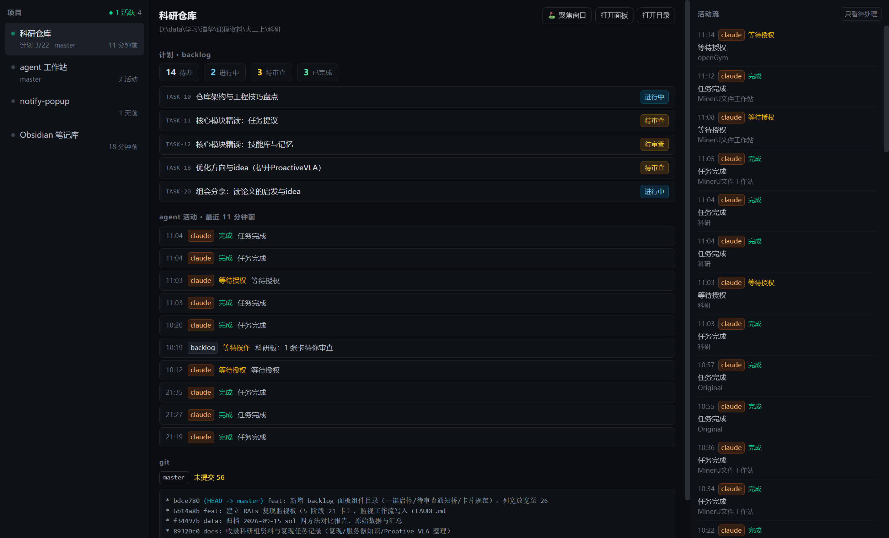

# agent 工作站 · agent-workstation

> 本机所有 coding agent 的总控台：按项目目录聚合终端 agent 的状态、计划与 git 变更。
>
> A local control deck for all your coding agents — organized by project directory.

## 它是什么

当你在十几个终端里跑着 Claude Code / Codex / pi 的时候，问题是：**谁在干活？干到哪了？计划对得上吗？**

现有工具（vibe-kanban、Crystal、Orca 等）大多是"从我这里派遣 agent 干活"（派活侧）；
agent-workstation 反过来做**观察侧**：不接管你的 agent 启动，做本机全部终端会话的总控台。

- **一个工作目录 = 一个项目**：左侧项目列表按目录聚合
- **活跃状态**：每个项目最近有没有 agent 动过、动了几次（数据源：notify-popup 事件日志）
- **计划追踪**：读取项目里 [Backlog.md](https://github.com/MrLesk/Backlog.md) 的任务数据（待办/进行中/待审查/已完成），计划与进展同屏对照
- **git 视野**：分支、未提交数、ahead/behind、最近提交图
- **一键跳回**：点击即把对应项目的终端 / 编辑器窗口切到前台

界面是三栏总控台：**项目列表 ｜ 项目详情 ｜ 全局活动流**（中文界面，i18n 结构预留）。



## 快速开始（源码版）

> 目前以源码运行，不提供安装包；`git pull` 后重启即是最新版。

依赖：**Windows 10/11**、Node.js ≥ 20、Git。

```bash
git clone https://github.com/lhd23333/agent-workstation.git
cd agent-workstation
npm install
cp projects.example.json projects.json   # 然后编辑它，填入你自己的项目路径
npm run dev
```

**已知坑（Windows + npm）**：若你的 npm 配置了 `ignore-scripts=true`，Electron 二进制不会在 `npm install` 时下载，
首次启动会报 `Error: Electron uninstall`。手动补一次即可：

```powershell
$env:ELECTRON_MIRROR = "https://npmmirror.com/mirrors/electron/"   # 国内加速，可省略
node node_modules/electron/install.js
```

### 开发小辅助

- **界面自查**：`AW_CAPTURE=1 npm run dev` 启动约 6 秒后，应用会把自身页面的真实渲染结果存到
  `docs/self-capture.png`（走 `webContents.capturePage`，不受 DPI 缩放 / 窗口遮挡 / z 序影响，
  改 UI 后自查很方便）。
- 主进程终端会转发渲染进程的 console 输出（`[renderer:*]` 前缀），页面报错直接可见。

## 配置：projects.json

项目登记在仓库根目录的 `projects.json`（该文件已加入 `.gitignore`，属于你的本地配置；
模板见 `projects.example.json`）：

```json
{
  "settings": {
    "notifyLogPath": "D:\\path\\to\\notify-popup\\notify-popup.log"
  },
  "projects": [
    {
      "name": "示例项目",
      "path": "D:\\path\\to\\your\\project",
      "panelUrl": "http://127.0.0.1:6420"
    }
  ]
}
```

| 字段 | 说明 |
|---|---|
| `name` / `path` | 项目显示名 / 工作目录绝对路径（一个目录 = 一个项目） |
| `panelUrl` | 可选：该项目自带的 web 面板（详情页出现「打开面板」按钮） |
| `settings.notifyLogPath` | notify-popup 的事件日志路径（活跃状态数据源） |

## 数据来源（全部本地，零云依赖）

| 数据 | 来源 | 缺失时表现 |
|---|---|---|
| agent 活跃状态 | 本机 notify-popup（右下角弹窗通知工具）的事件日志 | 活动流为空，其余功能正常 |
| 项目计划 | 各项目的 `backlog/tasks/*.md`（Backlog.md 格式） | 计划区显示为空 |
| git 状态 | 直接调用本机 `git` CLI | git 区显示为空 |

## 设计取向

- **观察者，不是派活器**：不启动、不接管 agent；你在哪跑它就看哪。
- **本地自包含**：无云服务、无遥测、无登录；配置就是仓库里的一个 JSON。
- **复用成熟组件**：Electron + React + Tailwind CSS；窗口聚焦逻辑参考了 notify-popup
  在 Windows 上踩过的坑（AttachThreadInput 解锁前台、终端进程白名单）。

## 路线图

- [x] **v0.1** 三栏总控台骨架：项目聚合 / 计划看板 / 活动流 / git 概览 / 点击聚焦
- [ ] 更细的 agent 会话粒度（同目录多会话区分）
- [ ] backlog 任务看板原生渲染（不再只读摘要）
- [ ] git graph 完整 DAG 渲染（当前为 `git log --graph` 文本）
- [ ] **计划 ↔ 进展对照分析**：卡住的项目、计划偏离提醒（核心差异功能）
- [ ] 英文界面（i18n）

## License

[MIT](LICENSE)
